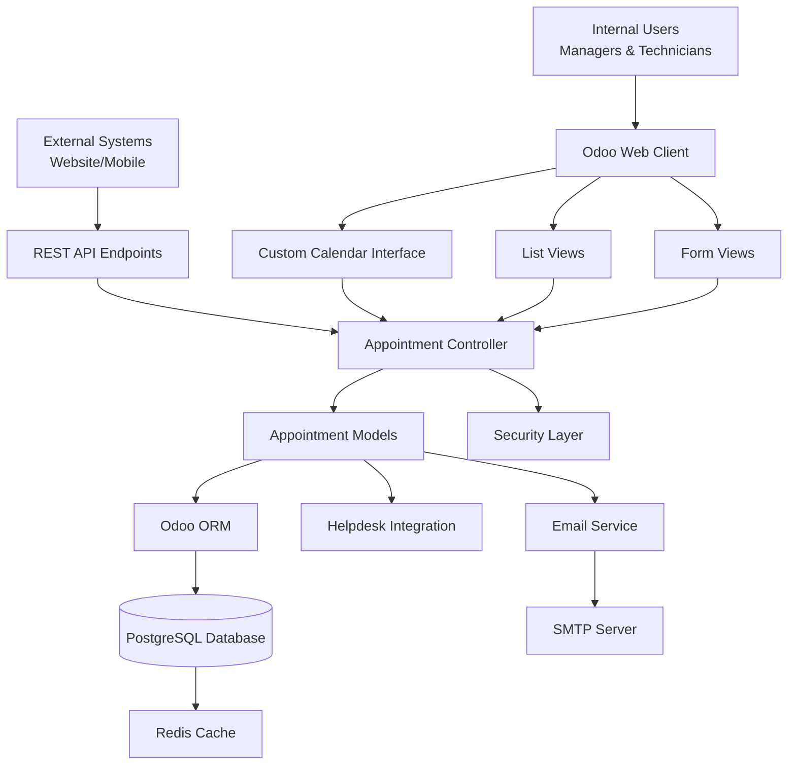
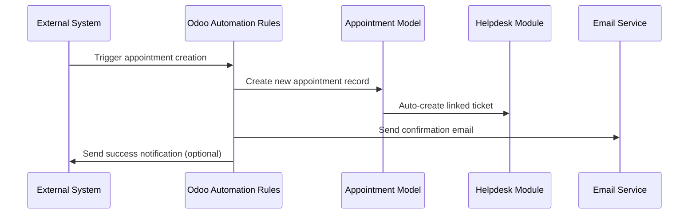
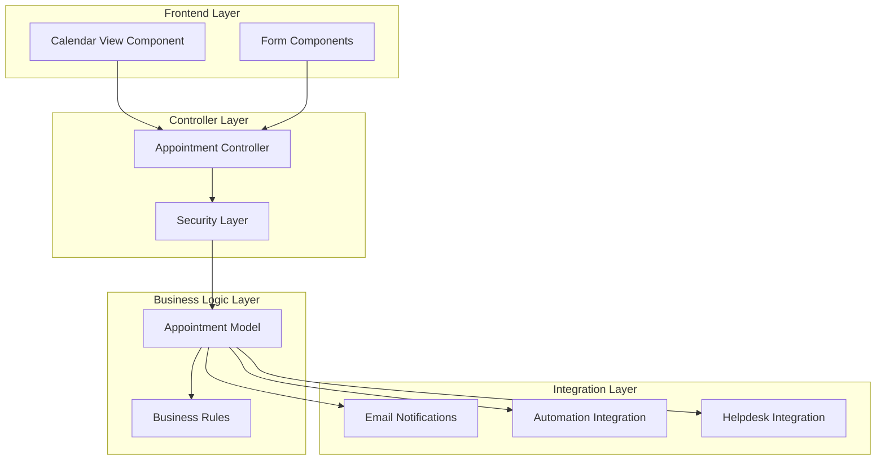
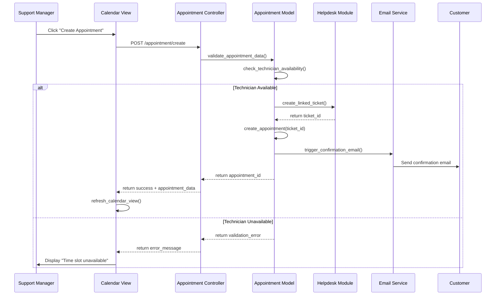
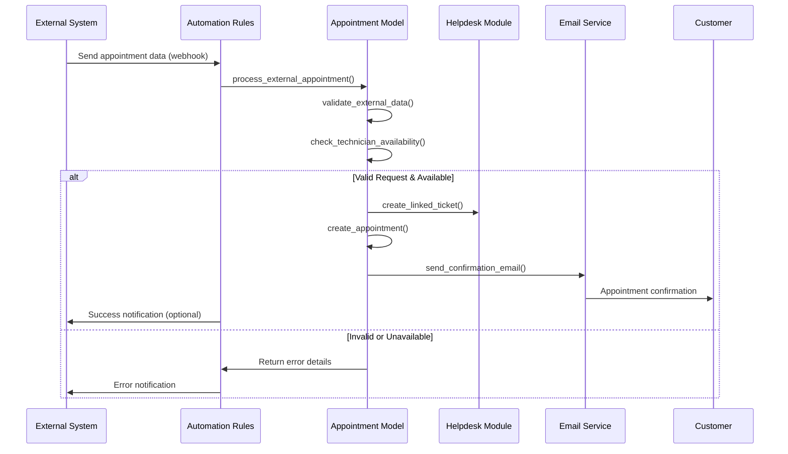
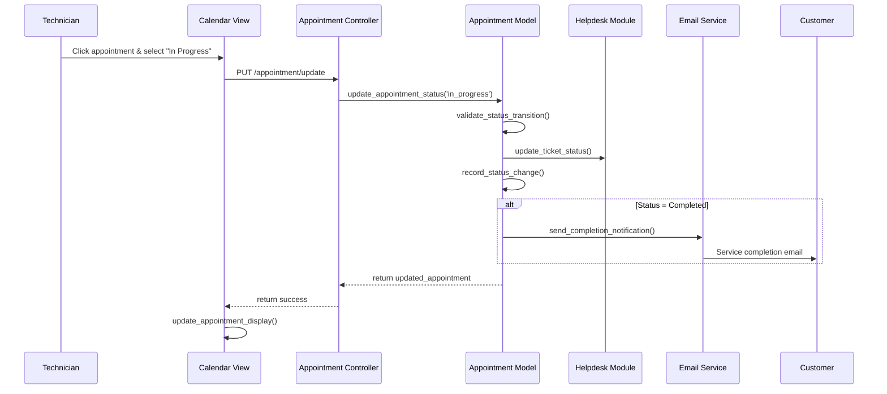
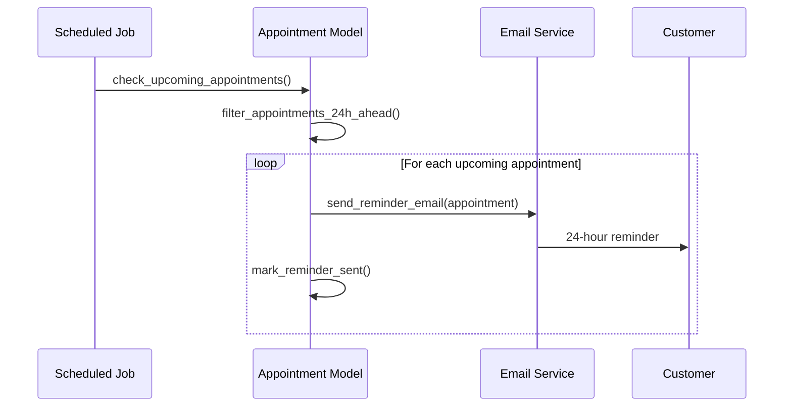
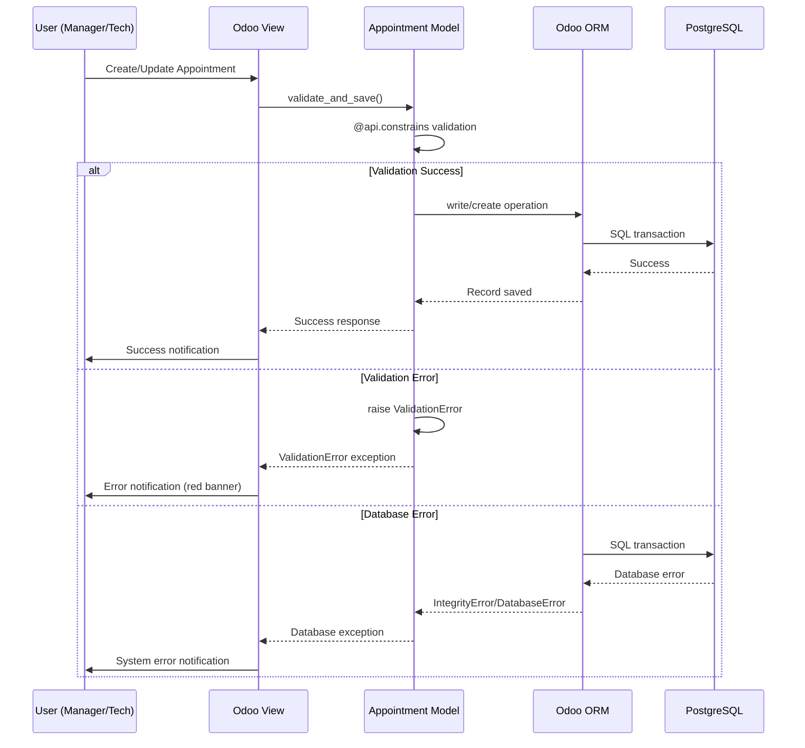

# Support Center Fullstack Architecture Document

## Introduction

This document outlines the complete fullstack architecture for **Support Center**, including backend systems, frontend implementation, and their integration. It serves as the single source of truth for AI-driven development, ensuring consistency across the entire technology stack.

This unified approach combines what would traditionally be separate backend and frontend architecture documents, streamlining the development process for modern fullstack applications where these concerns are increasingly intertwined.

### Starter Template or Existing Project

**Analysis:** The PRD indicates this is a custom Odoo module development project, not based on any starter template. The project will:

- Build upon the existing Odoo framework (v18.0)
- Integrate with existing Helpdesk module
- Use Odoo's standard backend theme and patterns
- Follow Odoo's module development conventions

**Decision:** Custom Odoo module development - leveraging Odoo's existing infrastructure while building module-specific functionality.

### Change Log
| Date | Version | Description | Author |
|------|---------|-------------|---------|
| Sep 13, 2025 | 1.0 | Initial architecture document | Winston (Architect) |

## High Level Architecture

### Technical Summary

The Support Center module follows Odoo's modular architecture pattern with a custom-built calendar interface that provides role-based appointment management. The system leverages Odoo's native ORM, security framework, and web client while extending it with specialized JavaScript components for the calendar functionality. Backend services handle appointment CRUD operations, API endpoints for external integrations, and automated email workflows, all tightly integrated with the existing Helpdesk module. The architecture emphasizes performance with sub-500ms response times and maintains security through Odoo's role-based access control system.

### Platform and Infrastructure Choice

**Platform:** Odoo (v18.0) on dedicated server infrastructure  
**Key Services:** PostgreSQL database, Nginx reverse proxy, Redis caching, SMTP service  
**Deployment Host and Regions:** Single region deployment (expandable)

### Repository Structure

**Structure:** Single repository for the Support Center module  
**Monorepo Tool:** Not applicable - standard Odoo module structure  
**Package Organization:** Standard Odoo module layout with models, views, controllers, and static assets

### High Level Architecture Diagram



### Architectural Patterns

- **Model-View-Controller (MVC):** Standard Odoo pattern for separating data, presentation, and business logic - _Rationale:_ Proven pattern within Odoo ecosystem ensuring maintainability
- **Active Record Pattern:** Odoo's ORM approach where models contain both data and behavior - _Rationale:_ Consistent with Odoo's architecture and development patterns
- **Role-Based Access Control (RBAC):** Odoo's native security model for permission management - _Rationale:_ Leverages existing, tested security infrastructure
- **Observer Pattern:** For automated email notifications triggered by appointment state changes - _Rationale:_ Decouples notification logic from core appointment management
- **API Gateway Pattern:** Centralized REST API endpoints for external system integration - _Rationale:_ Provides controlled access point with authentication and rate limiting
- **Command Query Responsibility Segregation (CQRS):** Separate read/write operations for calendar views vs appointment management - _Rationale:_ Optimizes performance for different use cases

## Tech Stack

| Category | Technology | Version | Purpose | Rationale |
|----------|------------|---------|---------|-----------|
| Backend Framework | Odoo | 18.0 | Complete application platform | Handles all database, ORM, security, and web serving |
| Backend Language | Python | 3.11+ | Business logic and models | Required by Odoo 18.0 for model definitions and business logic |
| Frontend Framework | Owl | 2.0 (Odoo 18.0) | Custom calendar interface | Odoo's native reactive framework for interactive components |
| UI Component Library | Odoo Web Client | 18.0 | Standard UI components | Native Odoo components ensure consistency |
| State Management | Owl Store | 2.0 | Calendar state management | Built-in state management for calendar interactions |
| Data Layer | Odoo ORM | 18.0 | All data operations | Handles all database interactions, no direct SQL needed |
| Authentication | Odoo Session Auth | 18.0 | User authentication | Native Odoo authentication with role-based access |
| API Integration | Automation Rules | 18.0 | External system webhooks | Odoo Community's native automation for external integrations |
| Frontend Testing | QUnit | Latest | JavaScript unit tests | Odoo's standard testing framework |
| Backend Testing | Python unittest | 3.11+ | Model and controller tests | Standard testing for Odoo modules |
| E2E Testing | Playwright | Latest | End-to-end testing | Modern browser automation for realistic testing |
| CSS Framework | Bootstrap | 5.3+ (via Odoo) | Responsive styling | Included in Odoo 18.0 |

## Data Models

### Appointment

**Purpose:** Central model for managing support appointments with technician assignments, customer information, and scheduling details. Integrates directly with helpdesk tickets to maintain service continuity.

**Key Attributes:**
- name: Char - Appointment reference/title for easy identification
- customer_id: Many2one(res.partner) - Link to customer contact record
- technician_id: Many2one(res.users) - Assigned support technician
- scheduled_date: Datetime - Appointment date and time
- duration: Float - Estimated duration in hours
- status: Selection - Current appointment state (draft, confirmed, in_progress, completed, cancelled)
- description: Text - Appointment notes and service details
- helpdesk_ticket_id: Many2one(helpdesk.ticket) - Required link to support ticket
- location: Char - Service location or address
- priority: Selection - Appointment priority level
- created_via: Selection - Source of appointment creation (internal, api, automation)

#### TypeScript Interface
```typescript
interface SupportAppointment {
  id: number;
  name: string;
  customer_id: [number, string];
  technician_id: [number, string];
  scheduled_date: string;
  duration: number;
  status: 'draft' | 'confirmed' | 'in_progress' | 'completed' | 'cancelled';
  description: string;
  helpdesk_ticket_id: [number, string];
  location: string;
  priority: 'low' | 'normal' | 'high' | 'urgent';
  created_via: 'internal' | 'api' | 'automation';
}
```

#### Relationships
- Many2one to res.partner (customer)
- Many2one to res.users (technician)
- Many2one to helpdesk.ticket (required integration)
- One2many from helpdesk.ticket (reverse relationship)

### Appointment Calendar Settings

**Purpose:** Configuration model for managing calendar-specific settings, working hours, and appointment constraints per technician or globally.

**Key Attributes:**
- name: Char - Configuration name
- technician_id: Many2one(res.users) - Specific technician (optional, global if empty)
- working_hours_start: Float - Daily start time
- working_hours_end: Float - Daily end time
- working_days: Char - Comma-separated weekday numbers
- max_daily_appointments: Integer - Daily appointment limit
- default_duration: Float - Default appointment duration
- advance_booking_days: Integer - Maximum days in advance for booking
- buffer_time: Float - Time buffer between appointments

#### TypeScript Interface
```typescript
interface AppointmentSettings {
  id: number;
  name: string;
  technician_id?: [number, string];
  working_hours_start: number;
  working_hours_end: number;
  working_days: string;
  max_daily_appointments: number;
  default_duration: number;
  advance_booking_days: number;
  buffer_time: number;
}
```

#### Relationships
- Many2one to res.users (optional technician)
- One2many reverse from res.users (technician settings)

## API Specification

### Automation Rules Integration

**Implementation Approach:** External systems will integrate with the Support Center module through Odoo's Automation Rules feature, which provides webhook-style integration without custom API development.

**Integration Methods:**

1. **Incoming Webhooks via Automation Rules**
   - External systems send data to Odoo via automated actions
   - Odoo processes incoming appointment requests through automation triggers
   - Response handling through email notifications or callback automations

2. **Outgoing Webhooks via Automation Rules**
   - Appointment state changes trigger automated external notifications
   - Email confirmations and reminders sent automatically
   - External system updates via automated HTTP requests

**Authentication:** Leverages Odoo's standard authentication mechanisms integrated with automation rules

**Data Format:** Standard Odoo record format (JSON) processed through automation rule conditions and actions

### External Integration Flow



## Components

### Appointment Model Component

**Responsibility:** Core business logic for appointment management, validation, and state transitions. Handles all CRUD operations and business rules for appointments.

**Key Interfaces:**
- create() - Appointment creation with validation
- write() - Update appointment details and status
- unlink() - Appointment cancellation with proper cleanup
- _check_availability() - Technician availability validation
- _auto_create_ticket() - Automatic helpdesk ticket creation

**Dependencies:** helpdesk.ticket, res.users, res.partner

**Technology Stack:** Python 3.11+, Odoo ORM 18.0, PostgreSQL backend

### Calendar View Component

**Responsibility:** Interactive calendar interface providing role-based views for managers and technicians. Handles real-time appointment display with color-coding and drag-drop functionality.

**Key Interfaces:**
- CalendarRenderer - Custom Owl component for calendar display
- AppointmentCard - Individual appointment representation
- DateNavigation - Calendar navigation controls
- StatusFilter - Appointment status filtering
- TechnicianFilter - Technician-specific view filtering

**Dependencies:** Appointment model, web client framework, user session

**Technology Stack:** Owl 2.0, JavaScript ES6+, Bootstrap 5.3+, Odoo web client

### Appointment Controller

**Responsibility:** Web controller handling HTTP requests for appointment operations. Provides endpoints for calendar data and form operations.

**Key Interfaces:**
- /appointment/calendar/data - JSON data for calendar rendering
- /appointment/create - Appointment creation endpoint
- /appointment/update - Appointment modification endpoint
- /appointment/delete - Appointment cancellation endpoint

**Dependencies:** Appointment model, security framework, session management

**Technology Stack:** Python HTTP controllers, Odoo web framework, JSON serialization

### Security Layer Component

**Responsibility:** Role-based access control ensuring managers see all appointments while technicians see only their assignments. Implements data filtering and permission validation.

**Key Interfaces:**
- ir.rule - Record-level security rules
- res.groups - User group definitions
- access_rights - CRUD permission matrix
- domain_filter() - Dynamic record filtering

**Dependencies:** res.users, res.groups, appointment records

**Technology Stack:** Odoo security framework, Python domain expressions

### Email Notification Component

**Responsibility:** Automated email system for appointment confirmations and reminders. Handles template rendering and delivery scheduling.

**Key Interfaces:**
- mail.template - Email template definitions
- ir.cron - Scheduled reminder jobs
- mail.mail - Email queue management
- _send_confirmation() - Immediate confirmation emails
- _send_reminder() - 24-hour reminder emails

**Dependencies:** mail framework, appointment model, cron scheduler

**Technology Stack:** Odoo mail system, Python email processing, SMTP integration

### Automation Integration Component

**Responsibility:** External system integration through automation rules. Processes incoming appointment requests and triggers outbound notifications.

**Key Interfaces:**
- base.automation - Automation rule definitions
- ir.actions.server - Server action processors
- webhook_processor() - Incoming data handler
- external_notification() - Outbound webhook sender

**Dependencies:** automation framework, appointment model, external systems

**Technology Stack:** Odoo automation engine, Python action processors, HTTP requests

### Component Diagrams



## External APIs

**Current Integration Status:** No external API integrations required for the Support Center module MVP.

**Email Integration Approach:** 
- Uses existing Odoo email configuration through `self.env['mail.mail']` system functions
- Leverages configured SMTP settings already in place
- No additional external API setup or authentication needed

**Integration Notes:** 
- All email functionality handled through Odoo's native mail system using your existing email configuration
- Appointment confirmations and reminders use standard `mail.template` and `mail.mail` objects
- External system integration handled through Automation Rules (webhook-style) - no external API calls required

## Core Workflows

### Manager Creates New Appointment Workflow



### External System Appointment Creation Workflow



### Technician Updates Appointment Status Workflow



### 24-Hour Reminder Workflow



## Frontend Architecture

### Component Architecture

**Component Organization (Odoo Module Structure)**
```text
support_center/
├── models/
│   ├── __init__.py
│   ├── support_appointment.py           # Main appointment model
│   └── appointment_settings.py          # Settings model
├── views/
│   ├── appointment_views.xml            # Calendar, list, form views
│   ├── appointment_menus.xml            # Menu definitions
│   └── appointment_templates.xml        # QWeb templates
├── security/
│   ├── ir.model.access.csv              # Access rights
│   └── security.xml                     # Security groups and rules
├── static/src/js/                       # Only for custom calendar widget
│   └── appointment_calendar.js          # Custom calendar component (minimal JS)
├── data/
│   ├── email_templates.xml              # Email templates (optional)
│   └── automation_rules.xml             # Automation rules
└── __manifest__.py                      # Module manifest
```

**Python Model Example (Primary Development)**
```python
# models/support_appointment.py
from odoo import models, fields, api
from odoo.exceptions import ValidationError

class SupportAppointment(models.Model):
    _name = 'support.appointment'
    _description = 'Support Appointment'
    _order = 'scheduled_date desc'

    name = fields.Char(string='Reference', required=True)
    customer_id = fields.Many2one('res.partner', string='Customer', required=True)
    technician_id = fields.Many2one('res.users', string='Technician', required=True)
    scheduled_date = fields.Datetime(string='Scheduled Date', required=True)
    status = fields.Selection([
        ('draft', 'Draft'),
        ('confirmed', 'Confirmed'),
        ('in_progress', 'In Progress'),
        ('completed', 'Completed'),
        ('cancelled', 'Cancelled')
    ], default='draft')
    
    # Optional email fields
    send_confirmation_email = fields.Boolean(string='Send Confirmation Email', default=False)
    send_reminder_email = fields.Boolean(string='Send Reminder Email', default=False)
    
    helpdesk_ticket_id = fields.Many2one('helpdesk.ticket', string='Related Ticket', required=True)

    @api.constrains('scheduled_date')
    def _check_scheduled_date(self):
        for record in self:
            if record.scheduled_date <= fields.Datetime.now():
                raise ValidationError("Cannot schedule appointments in the past")
```

**View Definition (XML)**
```xml
<!-- views/appointment_views.xml -->
<record id="view_appointment_calendar" model="ir.ui.view">
    <field name="name">support.appointment.calendar</field>
    <field name="model">support.appointment</field>
    <field name="arch" type="xml">
        <calendar string="Appointments" 
                  date_start="scheduled_date" 
                  color="technician_id"
                  mode="month">
            <field name="name"/>
            <field name="customer_id"/>
            <field name="status"/>
        </calendar>
    </field>
</record>
```

## Backend Architecture

### Service Architecture

**Model Organization**
```text
models/
├── __init__.py                          # Import all models
├── support_appointment.py               # Core appointment model
├── appointment_settings.py              # Configuration model
└── res_users.py                        # Extend users for technician functionality
```

**Model Template**
```python
# models/support_appointment.py
from odoo import models, fields, api, _
from odoo.exceptions import UserError, ValidationError
from datetime import datetime, timedelta

class SupportAppointment(models.Model):
    _name = 'support.appointment'
    _description = 'Support Center Appointment'
    _inherit = ['mail.thread', 'mail.activity.mixin']
    _order = 'scheduled_date desc'

    # Core fields
    name = fields.Char(string='Reference', required=True, copy=False, readonly=True, default='New')
    customer_id = fields.Many2one('res.partner', string='Customer', required=True, tracking=True)
    technician_id = fields.Many2one('res.users', string='Technician', required=True, tracking=True)
    scheduled_date = fields.Datetime(string='Scheduled Date', required=True, tracking=True)
    duration = fields.Float(string='Duration (Hours)', default=1.0)
    status = fields.Selection([
        ('draft', 'Draft'),
        ('confirmed', 'Confirmed'),
        ('in_progress', 'In Progress'),
        ('completed', 'Completed'),
        ('cancelled', 'Cancelled')
    ], default='draft', tracking=True)
    
    # Integration fields
    helpdesk_ticket_id = fields.Many2one('helpdesk.ticket', string='Related Ticket', required=True)
    
    # Optional email fields
    send_confirmation_email = fields.Boolean(string='Send Confirmation Email', default=False)
    send_reminder_email = fields.Boolean(string='Send Reminder Email', default=False)
    confirmation_sent = fields.Boolean(string='Confirmation Sent', default=False)
    reminder_sent = fields.Boolean(string='Reminder Sent', default=False)

    @api.model
    def create(self, vals):
        """Override create to auto-generate sequence and create ticket"""
        if vals.get('name', 'New') == 'New':
            vals['name'] = self.env['ir.sequence'].next_by_code('support.appointment') or 'New'
        
        # Auto-create helpdesk ticket if not provided
        if not vals.get('helpdesk_ticket_id'):
            ticket = self.env['helpdesk.ticket'].create({
                'name': f"Support Appointment: {vals.get('name', 'New')}",
                'partner_id': vals.get('customer_id'),
                'user_id': vals.get('technician_id'),
            })
            vals['helpdesk_ticket_id'] = ticket.id
            
        appointment = super().create(vals)
        
        # Send confirmation email if enabled
        if appointment.send_confirmation_email:
            appointment._send_confirmation_email()
            
        return appointment

    def _send_confirmation_email(self):
        """Send confirmation email using Odoo's mail system"""
        if not self.confirmation_sent:
            template = self.env.ref('support_center.email_template_appointment_confirmation', False)
            if template:
                template.send_mail(self.id, force_send=True)
                self.confirmation_sent = True

    @api.constrains('scheduled_date', 'technician_id')
    def _check_availability(self):
        """Check technician availability for the scheduled time"""
        for record in self:
            if record.scheduled_date <= fields.Datetime.now():
                raise ValidationError(_("Cannot schedule appointments in the past"))
            
            # Check for conflicts
            conflicts = self.search([
                ('technician_id', '=', record.technician_id.id),
                ('scheduled_date', '<=', record.scheduled_date),
                ('scheduled_date', '>=', record.scheduled_date - timedelta(hours=record.duration)),
                ('status', 'in', ['confirmed', 'in_progress']),
                ('id', '!=', record.id)
            ])
            if conflicts:
                raise ValidationError(_("Technician has conflicting appointments"))
```

### Database Architecture

**Schema Design (Handled by Odoo ORM)**
Odoo automatically creates the database schema from the Python model definitions. No manual SQL required.

**Data Access Layer**
```python
# Business logic methods in the model
class SupportAppointment(models.Model):
    # ... field definitions ...
    
    def action_confirm(self):
        """Confirm appointment and update ticket status"""
        self.ensure_one()
        self.status = 'confirmed'
        self.helpdesk_ticket_id.stage_id = self.env.ref('helpdesk.stage_in_progress')
        self.message_post(body=_("Appointment confirmed"))
        
    def action_start(self):
        """Start appointment work"""
        self.ensure_one()
        self.status = 'in_progress'
        self.message_post(body=_("Appointment started"))
        
    def action_complete(self):
        """Complete appointment and close ticket"""
        self.ensure_one()
        self.status = 'completed'
        self.helpdesk_ticket_id.stage_id = self.env.ref('helpdesk.stage_done')
        self.message_post(body=_("Appointment completed"))
        
    @api.model
    def get_calendar_data(self, domain=None, fields=None):
        """Get appointments for calendar view with proper security"""
        if not domain:
            domain = []
            
        # Apply security: technicians see only their appointments
        if not self.env.user.has_group('support_center.group_support_manager'):
            domain.append(('technician_id', '=', self.env.user.id))
            
        return self.search_read(domain, fields or ['name', 'customer_id', 'technician_id', 'scheduled_date', 'status'])
```

### Authentication and Authorization

**Auth Flow (Odoo Native)**
Uses Odoo's standard session-based authentication - no custom auth code needed.

**Middleware/Guards**
```python
# security/security.xml
<record id="group_support_manager" model="res.groups">
    <field name="name">Support Manager</field>
    <field name="category_id" ref="base.module_category_human_resources"/>
</record>

<record id="group_support_technician" model="res.groups">
    <field name="name">Support Technician</field>
    <field name="category_id" ref="base.module_category_human_resources"/>
</record>

<!-- Record rules for data access -->
<record id="appointment_manager_rule" model="ir.rule">
    <field name="name">Support Managers see all appointments</field>
    <field name="model_id" ref="model_support_appointment"/>
    <field name="groups" eval="[(4, ref('group_support_manager'))]"/>
    <field name="domain_force">[(1, '=', 1)]</field>
</record>

<record id="appointment_technician_rule" model="ir.rule">
    <field name="name">Technicians see only their appointments</field>
    <field name="model_id" ref="model_support_appointment"/>
    <field name="groups" eval="[(4, ref('group_support_technician'))]"/>
    <field name="domain_force">[('technician_id', '=', user.id)]</field>
</record>
```

## Unified Project Structure

```plaintext
support_center/
├── __manifest__.py                      # Module manifest and dependencies
├── __init__.py                          # Module initialization
├── models/                              # Python models (core business logic)
│   ├── __init__.py
│   ├── support_appointment.py           # Main appointment model
│   ├── appointment_settings.py          # Configuration settings
│   └── res_users.py                     # Extend users for technician features
├── views/                               # XML view definitions
│   ├── appointment_views.xml            # Calendar, list, form views
│   ├── appointment_menus.xml            # Menu structure and actions
│   ├── appointment_templates.xml        # QWeb templates (if needed)
│   └── settings_views.xml               # Configuration views
├── security/                            # Access control and permissions
│   ├── ir.model.access.csv             # Model access rights
│   └── security.xml                     # Security groups and record rules
├── data/                                # Default data and configuration
│   ├── sequences.xml                    # Appointment reference sequences
│   ├── email_templates.xml             # Email templates (optional)
│   └── automation_rules.xml            # External integration rules
├── static/                              # Web assets
│   ├── description/                     # Module description and icon
│   │   ├── icon.png
│   │   └── index.html
│   └── src/                            # Custom web components (minimal)
│       ├── css/
│       │   └── appointment_calendar.css # Custom calendar styling
│       └── js/                         # Only if custom calendar widgets needed
│           └── appointment_calendar.js  # Custom calendar interactions
├── tests/                               # Unit tests
│   ├── __init__.py
│   ├── test_appointment_model.py        # Model testing
│   └── test_appointment_workflow.py     # Workflow testing
├── wizard/                              # Wizard dialogs (if needed)
│   ├── __init__.py
│   └── appointment_wizard.py            # Quick create wizards
├── report/                              # Reports (future enhancement)
│   └── appointment_report.xml           # Appointment reports
└── README.md                            # Module documentation
```

## Development Workflow

### Local Development Setup

#### Prerequisites
```bash
# Install Python 3.11+
sudo apt-get install python3.11 python3.11-dev python3.11-venv

# Install PostgreSQL
sudo apt-get install postgresql postgresql-contrib

# Install Git
sudo apt-get install git

# Install Node.js (for Odoo assets)
curl -fsSL https://deb.nodesource.com/setup_18.x | sudo -E bash -
sudo apt-get install -y nodejs
```

#### Initial Setup
```bash
# Clone Odoo 18.0
git clone --depth 1 --branch 18.0 https://github.com/odoo/odoo.git
cd odoo

# Create Python virtual environment
python3.11 -m venv venv
source venv/bin/activate

# Install Odoo dependencies
pip install -r requirements.txt

# Create PostgreSQL user and database
sudo -u postgres createuser -s $USER
createdb odoo18_dev

# Create addons directory for custom modules
mkdir ../custom-addons
cd ../custom-addons

# Clone or create support_center module
git clone [your-support-center-repo] support_center
# OR
mkdir support_center && cd support_center
# Create module structure following unified project structure
```

#### Development Commands
```bash
# Start Odoo development server
cd /path/to/odoo
source venv/bin/activate
python odoo-bin -d odoo18_dev --addons-path=addons,../custom-addons --dev=reload,qweb,werkzeug,xml

# Start with module installation
python odoo-bin -d odoo18_dev --addons-path=addons,../custom-addons -i support_center --dev=reload

# Update module after changes
python odoo-bin -d odoo18_dev --addons-path=addons,../custom-addons -u support_center --dev=reload

# Run tests
python odoo-bin -d odoo18_test --addons-path=addons,../custom-addons --test-enable --stop-after-init -i support_center
```

### Environment Configuration

#### Required Environment Variables
```bash
# Odoo Configuration (.odoorc or odoo.conf)
[options]
db_host = localhost
db_port = 5432
db_user = your_username
db_password = 
addons_path = addons,../custom-addons
admin_passwd = admin_password
dev_mode = reload,qweb,werkzeug,xml
log_level = debug

# Development Database Settings
db_name = odoo18_dev
db_template = template0

# Email Settings (Optional - for testing emails)
email_from = noreply@yourcompany.com
smtp_server = localhost
smtp_port = 1025  # For development mail server
smtp_user = 
smtp_password = 
smtp_ssl = False
```

## Deployment Architecture

### Deployment Strategy

**Module Deployment:**
- **Platform:** Odoo 18.0 server installation
- **Deployment Method:** Standard Odoo module installation via Apps interface
- **Module Location:** `/opt/odoo/custom-addons/support_center/`
- **Update Process:** Module update through Odoo interface or command line

**Database Management:**
- **Migration:** Odoo's built-in migration system handles database schema updates
- **Backup Strategy:** Regular PostgreSQL dumps with point-in-time recovery
- **Data Integrity:** Foreign key constraints ensure referential integrity

#### CI/CD Pipeline
```yaml
# .github/workflows/deploy.yml
name: Deploy Support Center Module

on:
  push:
    branches: [ main ]
  pull_request:
    branches: [ main ]

jobs:
  test:
    runs-on: ubuntu-latest
    services:
      postgres:
        image: postgres:15
        env:
          POSTGRES_PASSWORD: postgres
        options: >-
          --health-cmd pg_isready
          --health-interval 10s
          --health-timeout 5s
          --health-retries 5

    steps:
    - uses: actions/checkout@v3
    
    - name: Set up Python 3.11
      uses: actions/setup-python@v3
      with:
        python-version: 3.11
        
    - name: Clone Odoo 18.0
      run: |
        git clone --depth 1 --branch 18.0 https://github.com/odoo/odoo.git
        
    - name: Install dependencies
      run: |
        cd odoo
        pip install -r requirements.txt
        
    - name: Run module tests
      run: |
        cd odoo
        python odoo-bin -d test_db --addons-path=addons,../support_center --test-enable --stop-after-init -i support_center
        
  deploy:
    needs: test
    runs-on: ubuntu-latest
    if: github.ref == 'refs/heads/main'
    
    steps:
    - name: Deploy to production
      run: |
        # Copy module to production server
        # Restart Odoo service
        # Update module
        echo "Deploy to production server"
```

#### Environments

| Environment | Purpose | Deployment Method |
|------------|---------|------------------|
| Development | Local development and testing | Direct file system access |
| Staging | Pre-production testing | Git deployment with module update |
| Production | Live environment | Controlled deployment with backup |

## Security and Performance

### Security Requirements

**Module Security:**
- Access Control: Odoo's native groups and record rules (no custom security code)
- Data Validation: Python model constraints and field validation
- Input Sanitization: Odoo ORM automatically handles SQL injection prevention

**Authentication Security:**
- User Authentication: Odoo's standard session-based authentication
- Role-Based Access: Two security groups (Support Manager, Support Technician)
- Session Management: Odoo's built-in session timeout and management

**Data Security:**
- Record-Level Security: Technicians access only their appointments
- Field-Level Security: Sensitive fields restricted by user groups
- Audit Trail: Built-in tracking on critical fields (customer, technician, status)

```python
# Example security implementation in models
class SupportAppointment(models.Model):
    _name = 'support.appointment'
    _inherit = ['mail.thread', 'mail.activity.mixin']  # Automatic audit trail
    
    customer_id = fields.Many2one('res.partner', tracking=True)  # Track changes
    technician_id = fields.Many2one('res.users', tracking=True)
    status = fields.Selection([...], tracking=True)
    
    @api.constrains('customer_id', 'technician_id')
    def _validate_users(self):
        """Ensure valid user assignments"""
        for record in self:
            if not record.technician_id.has_group('support_center.group_support_technician'):
                raise ValidationError("Assigned user must be a support technician")
```

**Security Configuration:**
```xml
<!-- security/security.xml -->
<!-- Record rules enforce data access policies -->
<record id="appointment_technician_rule" model="ir.rule">
    <field name="name">Technicians see only their appointments</field>
    <field name="model_id" ref="model_support_appointment"/>
    <field name="domain_force">[('technician_id', '=', user.id)]</field>
    <field name="groups" eval="[(4, ref('group_support_technician'))]"/>
</record>
```

### Performance Optimization

**Database Performance:**
- Index Optimization: Odoo automatically creates indexes for foreign keys and frequently queried fields
- Query Optimization: Use `search_read()` for list views, limit record sets with domains
- Caching Strategy: Odoo's built-in ORM caching handles frequently accessed data

**Calendar Performance:**
- Data Limiting: Calendar views load only visible date range
- Field Selection: Load only required fields for calendar display
- Lazy Loading: Appointment details loaded on-demand when opened

```python
# Performance-optimized calendar data loading
@api.model
def get_calendar_appointments(self, start_date, end_date):
    """Optimized calendar data loading"""
    domain = [
        ('scheduled_date', '>=', start_date),
        ('scheduled_date', '<=', end_date),
        ('status', '!=', 'cancelled')
    ]
    
    # Apply security domain
    if not self.env.user.has_group('support_center.group_support_manager'):
        domain.append(('technician_id', '=', self.env.user.id))
    
    # Load only required fields
    fields = ['name', 'customer_id', 'technician_id', 'scheduled_date', 'status', 'duration']
    return self.search_read(domain, fields, limit=1000)
```

## Testing Strategy

### Testing Pyramid

```text
    Playwright E2E Tests
   /                  \
Python Unit Tests   Manual Testing
```

### Local Testing Setup

#### Install Odoo Locally for Testing
```bash
# 1. Install Odoo 18.0 locally
git clone --depth 1 --branch 18.0 https://github.com/odoo/odoo.git
cd odoo

# 2. Create virtual environment
python3.11 -m venv venv
source venv/bin/activate
pip install -r requirements.txt

# 3. Setup test database
createdb odoo_test
python odoo-bin -d odoo_test --addons-path=addons,../custom-addons -i support_center --stop-after-init

# 4. Start Odoo in test mode
python odoo-bin -d odoo_test --addons-path=addons,../custom-addons --dev=reload
```

#### Playwright Setup for Odoo Testing
```bash
# Install Playwright
npm install -D @playwright/test
npx playwright install

# Create test directory structure
mkdir -p tests/playwright
cd tests/playwright
```

### Test Organization

#### Local Test Structure
```text
tests/
├── python/                             # Python unit tests
│   ├── test_appointment_model.py        # Model validation
│   └── test_appointment_workflow.py     # Business logic
├── playwright/                          # Web UI tests
│   ├── tests/
│   │   ├── manager-workflow.spec.js     # Manager user journey
│   │   ├── technician-workflow.spec.js  # Technician user journey
│   │   └── calendar-interactions.spec.js # Calendar functionality
│   ├── fixtures/
│   │   └── odoo-setup.js                # Test data setup
│   └── playwright.config.js             # Playwright configuration
└── manual/                              # Manual test scenarios
    └── test-checklist.md                # Manual verification steps
```

### Test Examples

#### Playwright Configuration
```javascript
// tests/playwright/playwright.config.js
import { defineConfig } from '@playwright/test';

export default defineConfig({
  testDir: './tests',
  timeout: 30000,
  use: {
    baseURL: 'http://localhost:8069',
    headless: false, // Set to true for CI
    screenshot: 'only-on-failure',
    video: 'retain-on-failure',
  },
  projects: [
    {
      name: 'support-center',
      testMatch: '**/*.spec.js',
    },
  ],
});
```

#### Manager Workflow Test
```javascript
// tests/playwright/tests/manager-workflow.spec.js
import { test, expect } from '@playwright/test';

test.describe('Support Manager Workflow', () => {
  test.beforeEach(async ({ page }) => {
    // Login as manager
    await page.goto('/web/login');
    await page.fill('input[name="login"]', 'admin');
    await page.fill('input[name="password"]', 'admin');
    await page.click('button[type="submit"]');
    
    // Navigate to Support Center
    await page.click('text=Support Center');
    await page.waitForLoadState('networkidle');
  });

  test('create new appointment', async ({ page }) => {
    // Click create appointment button
    await page.click('button:has-text("Create")');
    
    // Fill appointment form
    await page.fill('input[name="customer_id"]', 'Test Customer');
    await page.selectOption('select[name="technician_id"]', { label: 'John Technician' });
    
    // Set appointment date (tomorrow)
    const tomorrow = new Date();
    tomorrow.setDate(tomorrow.getDate() + 1);
    await page.fill('input[name="scheduled_date"]', tomorrow.toISOString().split('T')[0]);
    
    // Save appointment
    await page.click('button:has-text("Save")');
    
    // Verify appointment created
    await expect(page.locator('.o_notification_title')).toContainText('Record saved');
    
    // Verify appointment appears in calendar
    await page.click('text=Calendar');
    await expect(page.locator('.fc-event')).toBeVisible();
  });
});
```

#### Running Tests Locally
```bash
# 1. Start Odoo test instance
cd /path/to/odoo
source venv/bin/activate
python odoo-bin -d odoo_test --addons-path=addons,../custom-addons --dev=reload

# 2. Setup test data (create users, sample appointments)
# You can do this through Odoo UI or data fixtures

# 3. Run Playwright tests
cd tests/playwright
npx playwright test

# 4. Run specific test
npx playwright test manager-workflow.spec.js

# 5. Run in headed mode (see browser)
npx playwright test --headed

# 6. Debug mode
npx playwright test --debug
```

#### Python Unit Tests (Local)
```bash
# Run Python unit tests
python odoo-bin -d odoo_test --test-enable --stop-after-init -i support_center

# Run with specific test
python odoo-bin -d odoo_test --test-enable --test-tags support_center
```

## Coding Standards

### Critical Fullstack Rules

- **Odoo Model Fields:** Always use proper Odoo field types with required attributes - never use generic `fields.Char()` without string parameter
- **Security Groups:** Every model must have proper security groups defined in `security/` directory - never skip access control
- **Helpdesk Integration:** All appointments MUST have `helpdesk_ticket_id` as required field - never create orphaned appointments
- **Status Validation:** Use selection fields with proper constraints for appointment status - never allow invalid status values
- **Email Optional:** Check `send_confirmation_email` and `send_reminder_email` flags before sending - never assume emails are wanted
- **Date Validation:** Always validate `scheduled_date` is in future using `@api.constrains` - never allow past appointments
- **Technician Assignment:** Validate assigned user has technician group membership - never assign non-technicians
- **ORM Usage:** Always use `self.env['model.name']` for database operations - never write raw SQL
- **Record Rules:** Technicians see only their appointments via record rules - never bypass security in code
- **Module Dependencies:** Declare `helpdesk` and `mail` dependencies in `__manifest__.py` - never assume modules are installed

### Naming Conventions

| Element | Convention | Example |
|---------|------------|---------|
| Models | snake_case with module prefix | `support.appointment` |
| Fields | snake_case | `scheduled_date`, `customer_id` |
| Methods | snake_case with underscore prefix for private | `_check_availability()` |
| XML IDs | snake_case with model prefix | `view_appointment_calendar` |
| Security Groups | module.group_role format | `support_center.group_support_manager` |
| Menu Items | descriptive with hierarchy | `menu_support_center_main` |

## Error Handling Strategy

### Error Flow



### Error Response Format

Odoo handles error formatting automatically through its exception system:

```python
# Standard Odoo error types used in the module
from odoo.exceptions import ValidationError, UserError, AccessError

class SupportAppointment(models.Model):
    _name = 'support.appointment'
    
    @api.constrains('scheduled_date', 'technician_id')
    def _check_appointment_validity(self):
        """Validate appointment constraints"""
        for record in self:
            # Past date validation
            if record.scheduled_date <= fields.Datetime.now():
                raise ValidationError(_("Cannot schedule appointments in the past."))
            
            # Technician availability validation
            conflicts = self.search([
                ('technician_id', '=', record.technician_id.id),
                ('scheduled_date', '<=', record.scheduled_date + timedelta(hours=record.duration)),
                ('scheduled_date', '>=', record.scheduled_date - timedelta(hours=record.duration)),
                ('status', 'in', ['confirmed', 'in_progress']),
                ('id', '!=', record.id)
            ])
            if conflicts:
                raise ValidationError(_(
                    "Technician %s has conflicting appointments at this time."
                ) % record.technician_id.name)
```

## Monitoring and Observability

### Monitoring Stack

- **Application Monitoring:** Odoo's built-in logging system with custom loggers for appointment events
- **Database Monitoring:** PostgreSQL logs and Odoo's database query logging  
- **Error Tracking:** Odoo's exception logging with custom error handlers for appointment workflows
- **Performance Monitoring:** Odoo's built-in profiling for general system health

### Key Metrics

**Appointment Metrics:**
- Appointment creation rate and success rate
- Status transition timing (draft → confirmed → completed)
- Technician utilization and scheduling conflicts
- Email notification success/failure rates (when enabled)

**System Health Metrics:**
- Database query performance for appointment searches
- User session activity and concurrent usage
- Error rates and exception tracking

### Implementation

```python
# Custom logging for appointment events
import logging

_logger = logging.getLogger(__name__)

class SupportAppointment(models.Model):
    _name = 'support.appointment'
    
    @api.model
    def create(self, vals):
        """Create appointment with monitoring"""
        try:
            appointment = super().create(vals)
            _logger.info(f"Appointment {appointment.name} created successfully")
            return appointment
            
        except Exception as e:
            _logger.error(f"Appointment creation failed: {str(e)}")
            raise
            
    def write(self, vals):
        """Update appointment with monitoring"""
        old_status = self.status
        result = super().write(vals)
        
        # Log status changes
        if 'status' in vals and vals['status'] != old_status:
            _logger.info(f"Appointment {self.name} status changed: {old_status} → {vals['status']}")
            
        return result
```